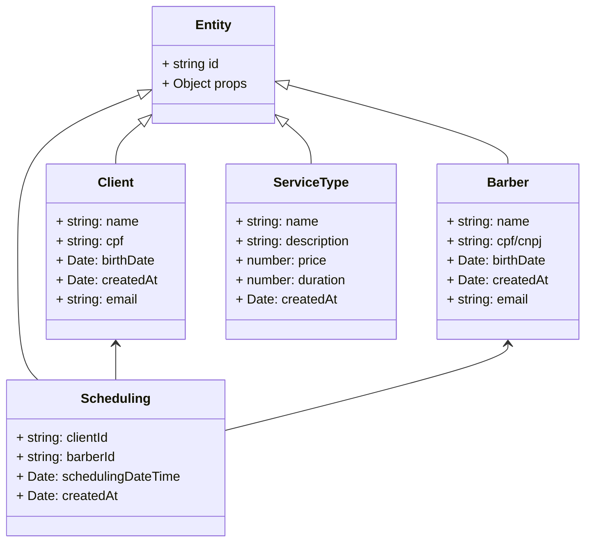

# Descrição do domain

## Entidades

As entidades do `domain` são:

|    Nome     |         Descrição          |
|:-----------:|:--------------------------:|
|   Client    |   Representa um cliente.   |
|   Barber    | Representa um cabelereiro. |
| Scheduling  | Representa um agendamento. |
| ServiceType |   Representa um serviço.   |

## Diagrama de classes:

## Descrição dos campos

| Campo              | Descrição                              | Tipo   | Pertence à     |
|--------------------|----------------------------------------|--------|----------------|
| cpf / cnpj         | É o número de CPF / CNPJ da pessoa     | string | Client, Barber |
| birthDate          | É a data de nascimento da pessoa       | Date   | Client, Barber |
| createdAt          | Data de inserção do registro           | Date   | Todas          |
| schedulingDateTime | Data e horário de um agendamento       | Date   | Scheduling     |
| price              | É o preço de um serviço                | number | ServiceType    |
| duration           | É a duração de um serviço (em minutos) | number | ServiceType    |

---

# Requisitos Funcionais

## Regras de negócio

Legenda:

- ✔️ implementado
- 🤞 a ser implementado

| Situação | Regra                                                                                        |
|:--------:|----------------------------------------------------------------------------------------------|
|    ✔️    | Todas as entidades devem possuir um id.                                                      |
|    ✔️    | Um agendamento deve possuir: um único cliente, um único barbeiro e um único tipo de serviço. |
|    🤞    | Um barbeiro não pode possuir dois agendamentos para um mesmo horário.                        |
|    🤞    | Um cliente não pode possuir dois agendamentos para um mesmo horário.                         |
|          |                                                                                              |
